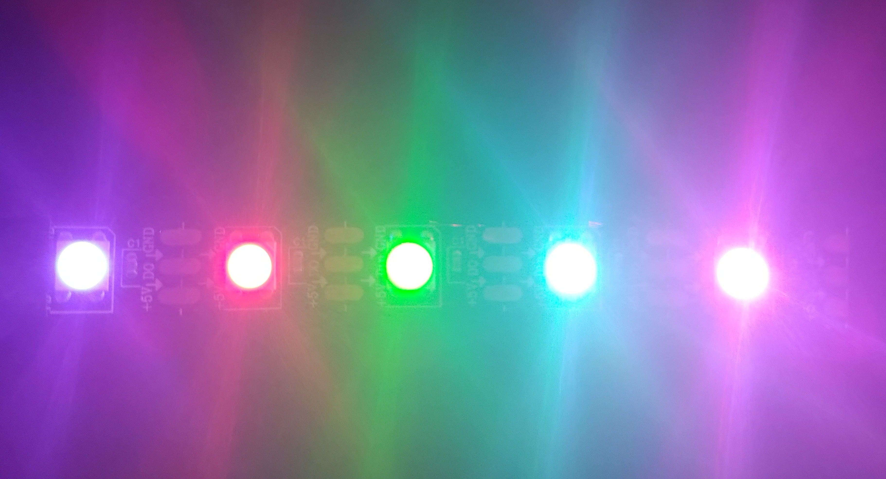

# DMALightFlow
This project uses the DMA on the STM32F401RE microcontroller to send the varying duty cycle data from the memory of the STM32 to the Timer peripheral for controlling the WS2812B LED strip.

## BitBanging
In order to experience the issues of using the CPU to control the LEDs, I started out with using the CPU to light the LEDs using the approach called as BitBanging. This process delays a GPIO Pin output by keeping it high for a certain amount of time, then toggles the pin to a low. This essentially simulates the varying PWM type signal required to control the WS2812B strip.

The `set_ws2812b_color_bitbanging` function in the WS2812B driver source file attempts bitbanging without using any HAL functions to avoid any overhead. This chunk of code has to be run with very few lines of code and functions calls so that there is less latency from the CPU to send the signal. The parameters WS2812B_TH_1 and WS2812B_TH_0 might need to be tuned to control the timing. I am still in the process of being able to make this function to work.

The Timer used for delay is `Timer 3`
Input Clock Freq for the APB1 Bus: 80 MHz
Prescaler : 1
AutoReload Register/Counter : 65535

## DMA Control
I am using `Timer3 Channel 2` configured with a clock input of 80 MHz, AutoReload Register set to 99, Prescaler is 0. This gives us a period of 1.25 us.

DMA Settings (Memory to Peripheral):
Normal Mode -> Since Data will be latched once we send reset command and incrementing only the memory address
FIFO Mode   -> Half Word Data width for both peripheral and memory since PWM CCR Register is a 16 bit value

In the NVIC Settings, the `DMA1 stream5 global interrupt` and the `TIM3 global interrupt` are enabled.

The timer sends a request to the DMA by setting the `CC2DE` bit. Once the DMA transfer is complete, `TCIF` event flag is set using the `Transfer Complete` Interrupt Event.

